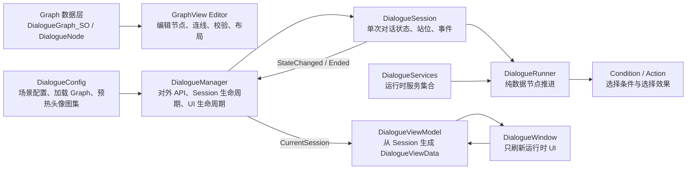
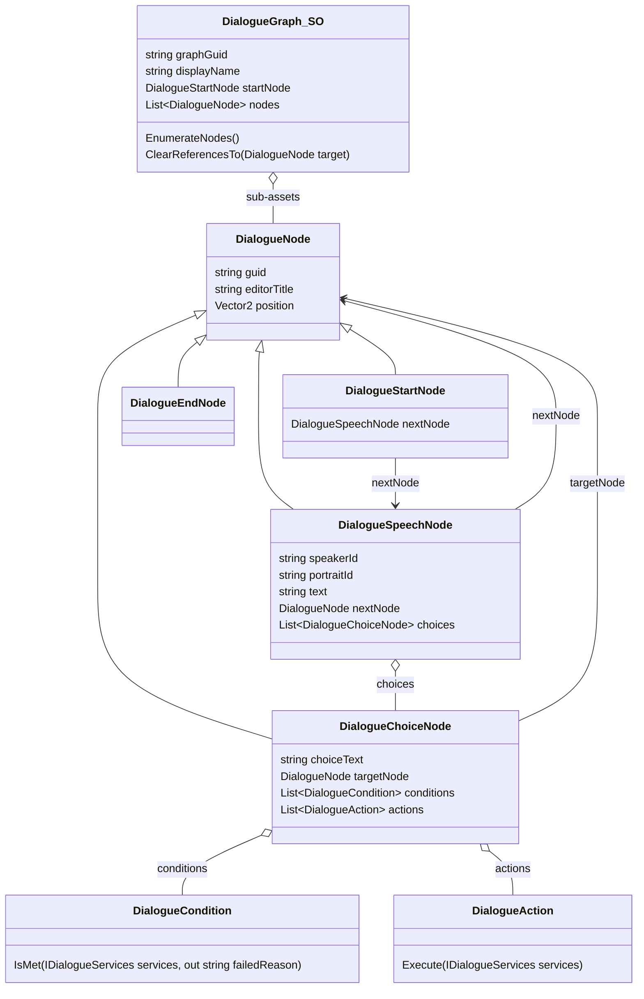
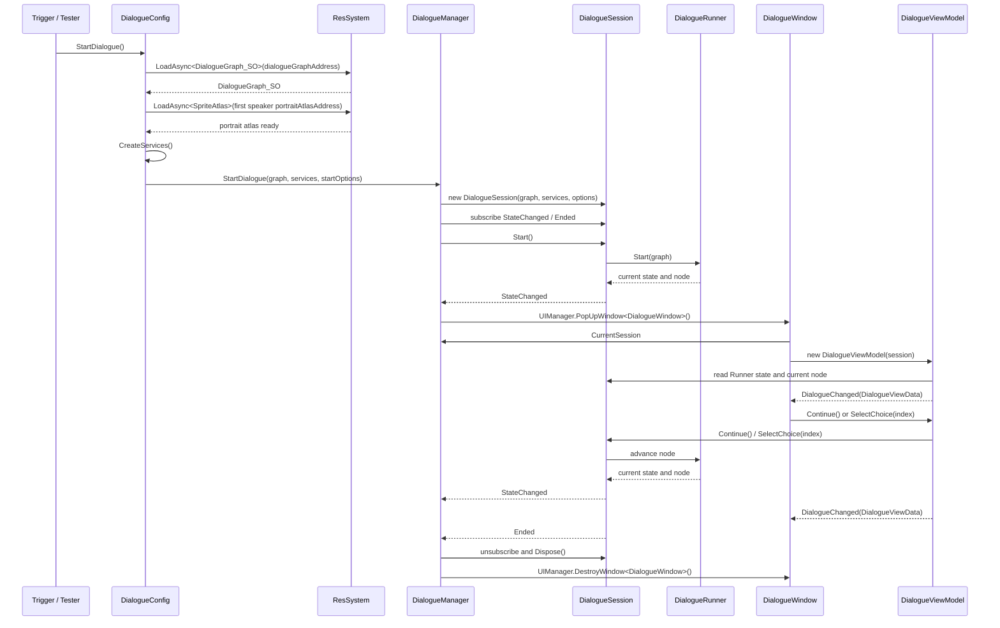

# Dialogue 框架说明

本文档说明当前 Dialogue 系统的框架职责、数据结构、编辑器结构、运行时会话流、UI 接入方式，以及 Condition / Action / Service 的扩展位置。

当前实现中，`Choice` 是独立的 `DialogueChoiceNode`，并作为 `DialogueGraph_SO` 的 sub-asset 保存；`DialogueSpeechNode` 直接持有自己的 `choices` 列表。运行时进入 Speech 时直接读取该 Speech 的 Choice，不需要遍历整张图查找来源。

## 模块职责

核心边界如下：

- `DialogueGraph_SO`：静态对话资产，持有所有节点 sub-asset。
- `DialogueGraphView` / Editor：只负责编辑 Graph 数据，不负责运行时播放。
- `DialogueRunner`：纯数据流转，只关心当前节点、继续、选择、结束。
- `DialogueSession`：一次播放会话，持有 Runner、Services、左右说话人站位，并对外发出 `StateChanged` / `Ended`。
- `DialogueManager`：对外门面，负责创建和销毁 Session，打开和销毁 `DialogueWindow`。
- `DialogueConfig`：场景中的配置入口，负责通过 Addressables Key 加载 Graph，创建 Services，再调用 Manager。
- `DialogueWindow`：运行时窗口，只根据 `DialogueViewData` 刷新文本、头像、选项。
- `DialogueViewModel`：从 `DialogueManager.CurrentSession` 读取当前 Session，并把 Session/Runner 状态转换为 UI 数据。

注意，运行时不是一条单向链 `DialogueConfig -> DialogueManager -> DialogueSession -> DialogueRunner -> DialogueViewModel -> DialogueWindow`。实际关系是：`DialogueManager` 持有当前 `DialogueSession`；`DialogueSession` 通过事件反馈状态变化和结束；`DialogueWindow` 创建 `DialogueViewModel` 后，通过 `DialogueManager.CurrentSession` 取得当前会话并驱动 UI。

## 数据结构

节点连接含义：

- `Start -> Speech`：对话入口。
- `Speech -> Speech`：线性继续，运行时点击对话框推进。
- `Speech -> End`：线性结束，运行时点击对话框后结束。
- `Speech -> Choice`：玩家可见选项。
- `Choice -> Speech`：选择后进入目标对白。
- `Choice -> End`：选择后结束对话。

`guid` 用于编辑器稳定识别、调试和未来导出，不作为运行时跳转主逻辑。运行时引用主要依赖 SO 引用关系。

## 运行时会话流

这个流程里，`Session` 不直接操作 UI。结束时由 `Session.Ended` 通知 `DialogueManager`，再由 `DialogueManager.EndCurrentDialogue()` 统一销毁窗口、释放当前 Session，并触发对外事件。

## GraphView Editor

编辑器由 `DialogueGraphEditorWindow`、`DialogueGraphEditorView`、`DialogueGraphView`、`DialogueGraphEditorViewModel` 和 `DialogueNodeView` 组成。

- `DialogueGraphEditorWindow`：窗口入口、UXML/USS 加载、Undo/Redo 刷新。
- `DialogueGraphEditorView`：右侧 Details / Validation 面板绑定。
- `DialogueGraphView`：节点视图、连线交互、布局菜单、运行时当前节点高亮。
- `DialogueGraphEditorViewModel`：Graph 数据操作、Undo、Dirty、校验。
- `DialogueNodeView`：单个节点卡片的显示和预览。

GraphView 只编辑资产数据。创建节点时使用 `ScriptableObject.CreateInstance<T>()`，并通过 `AssetDatabase.AddObjectToAsset(node, graph)` 把节点保存为 `DialogueGraph_SO` 的 sub-asset。

## Speaker 与头像

Speaker 数据由独立的 Speaker 数据资源维护。`DialogueSpeechNode` 只保存：

- `speakerId`
- `portraitId`

Graph 编辑器右侧 Details 使用属性绘制器显示下拉，不在 Editor View 中手写 Speaker / Portrait 列表逻辑。

运行时由 `DialogueViewModel` 根据当前 Speech 的 `speakerId` / `portraitId` 查询 Speaker 数据，并通过项目资源系统加载对应 Sprite。`DialogueSession` 只维护本次会话的左右站位：

- `leftSpeakerId`
- `rightSpeakerId`
- `SetSpeakerSide(string speakerId, DialoguePortraitSide side)`
- `IsLeftSpeaker(string speakerId)`

`DialogueViewData` 只输出当前说话人的 `portraitSprite` 和 `isLeftPortrait`，窗口根据这个布尔值决定头像显示在左侧还是右侧。

## Choice、Condition 与 Action

Choice 是独立节点，但归属于 `DialogueSpeechNode.choices`：

- `Speech -> Choice`：把 Choice 加入 `speech.choices`。
- 删除 `Speech -> Choice` 边：从 `speech.choices` 移除。
- 删除 Choice 节点：遍历所有 Speech，从各自 `choices` 中清理该 Choice。

Condition 与 Action 挂在 `DialogueChoiceNode` 上：

- `DialogueCondition.IsMet(IDialogueServices services, out string failedReason)` 返回是否满足以及失败原因。
- `DialogueAction.Execute(IDialogueServices services)` 在选择后执行。
- Runner 构建 Choice 列表时保留所有 Choice，不过滤不满足条件的选项。
- ViewModel 计算 `DialogueChoiceViewData.IsInteractable` 和 `DisabledReason`。
- Window 显示不可用 Choice，但按钮不可交互，并展示失败原因。
- `SelectChoice(index)` 不再二次检查条件，交互入口由 UI 控制。

## Services

`DialogueServices` 是运行时服务集合。Condition / Action 需要访问游戏系统时，不直接查找场景对象，而是从 Services 中取接口。

典型流程：

1. `DialogueConfig` 持有一组 `DialogueServiceFactory`。
2. 启动对话时 `DialogueConfig.CreateServices()` 创建 `DialogueServices`。
3. 每个 Factory 调用 `Install(DialogueServices services)` 注册服务。
4. Condition / Action 通过 `services.TryGet<T>()` 读取服务。

例如时间条件通过 `GameTimeDialogueServiceFactory` 把 `GameTimeManager.Instance` 包装为 `IGameTimeService` 注册到 Services，`TimeReachedCondition` 再通过该服务判断当前时间是否达标。

## UI 生命周期

`DialogueManager` 统一管理运行时 UI：

- `StartDialogue()` 创建 Session 后打开 `DialogueWindow`。
- 若 Graph 立即结束，则不打开空窗口。
- `EndCurrentDialogue()` 销毁 `DialogueWindow`。
- `DialogueWindow` 不主动销毁自己，只解绑 ViewModel、清空显示。

背景点击推进规则：

- 当前没有 Choice，且 `CanContinue == true`：点击背景调用 `Continue()`。
- 当前有 Choice：背景点击不推进。
- Choice 可交互时点击调用 `SelectChoice(index)`。
- Choice 不可交互时仍显示，但按钮禁用并显示失败原因。

