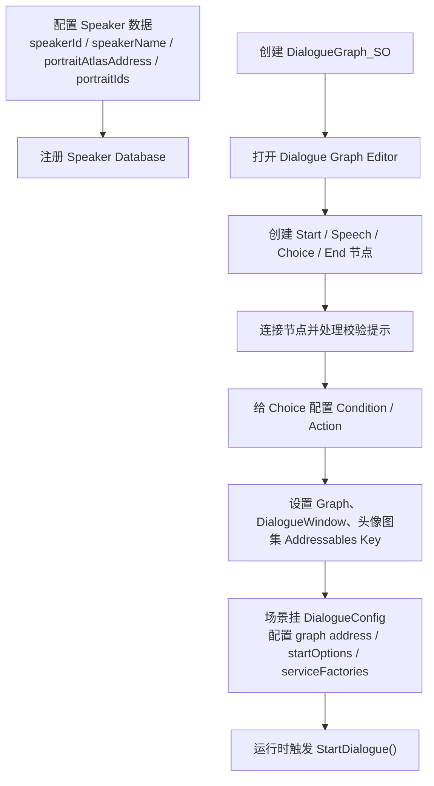
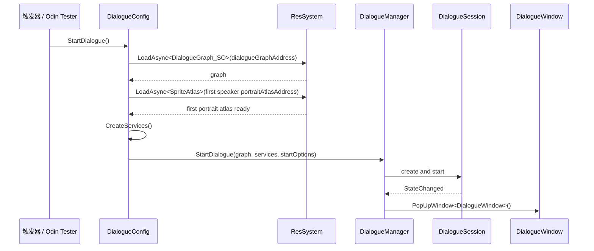
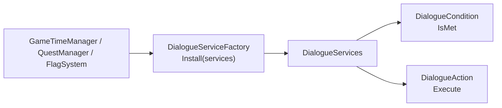

# Dialogue 使用文档

本文档说明如何从零配置一个可播放对话，以及如何编辑 Graph、接入 UI、配置 Speaker / Portrait、扩展 Condition / Action / Service，并排查常见问题。

## 快速流程



## 1. 配置 Speaker 与头像

Speaker 是运行时显示名字、颜色和头像的来源。每个 Speaker 建议配置：

- `speakerId`：对话节点里保存的稳定 ID。
- `speakerName`：UI 显示名。
- `nameColor`：名字颜色。
- `portraitAtlasAddress`：头像 SpriteAtlas 的 Addressables Key。
- `defaultPortraitId`：默认头像 ID。
- `portraitIds`：该角色可选头像 ID 列表。

`DialogueSpeechNode` 中只保存 `speakerId` 和 `portraitId`。在 Graph Editor 右侧 Details 面板中，这两个字段通过 `DialogueSpeakerIdAttribute` / `DialogueSpeakerPortraitIdAttribute` 绘制成下拉框。

头像资源建议放在同一个角色的 SpriteAtlas 中。`portraitId` 对应图集里的 Sprite 名称或项目约定的头像 ID，运行时由 ViewModel 根据 Speaker 数据和当前 Speech 查到对应 Sprite。

## 2. 创建 DialogueGraph

创建一个 `DialogueGraph_SO` 后，在 Dialogue Graph Editor 中编辑节点。打开图时如果没有 Start 节点，编辑器会显式创建一个 Start sub-asset。

核心节点：

- `DialogueStartNode`：入口节点，只连接一个 Speech。
- `DialogueSpeechNode`：对白节点，保存说话人、头像 ID、文本、线性后续和 Choice 列表。
- `DialogueChoiceNode`：玩家选项节点，保存选项文本、目标节点、条件和动作。
- `DialogueEndNode`：结束节点。

连接规则：

- `Start -> Speech`：对话入口。
- `Speech -> Speech`：线性继续，运行时点击对话框进入下一句。
- `Speech -> End`：线性结束。
- `Speech -> Choice`：显示玩家选项。
- `Choice -> Speech`：选择后进入目标对白。
- `Choice -> End`：选择后结束对话。

校验提示：

- Start 没有目标：入口未完成。
- Speech 同时有 `nextNode` 和 `choices`：同时存在线性继续和选项分支。
- Speech 没有 `nextNode` 且没有 Choice：对白没有后续。
- Choice 没有来源 Speech：Choice 不在任何 Speech 的 `choices` 中。
- Choice 没有目标：选择后没有跳转位置。

## 3. GraphView 操作

常用操作：

- 创建节点：在 GraphView 中添加 Speech / Choice / End。
- 编辑文本：选中 Speech，在右侧 Details 修改 Speaker、Portrait 和 Text。
- 编辑 Choice：选中 Choice，在右侧 Details 修改 Choice Text、Conditions、Actions。
- 连接节点：拖拽端口创建边。
- 删除节点或边：Graph 数据会同步清理引用。
- Undo / Redo：编辑器会重建或刷新视图，保持资产数据和节点视图一致。

长文本拆分：

- 一次屏幕显示对应一个 `DialogueSpeechNode`。
- 过长文本使用 `Split Speech Node`。
- 拆分后旧 Speech 保留前半段，新 Speech 保存后半段。
- 旧 Speech 的原 `nextNode` 和 `choices` 会迁移到新 Speech。
- 旧 Speech 的 `nextNode` 指向新 Speech，因此拆分后的结构是 `OldSpeech -> NewSpeech -> 原后续`。

布局：

- `Auto Layout`：按图结构自动分层排版。
- 右键 `Layout/Horizontal`：把选中节点作为横向排列的一组，支持上、中、下对齐和横向等间距。
- 右键 `Layout/Vertical`：把选中节点作为纵向排列的一组，支持左、中、右对齐和纵向等间距。
- 布局基于 `DialogueNodeView.GetPosition()` 的真实宽高计算，并写回节点 `position`。

## 4. 配置 Choice 条件和动作

Choice 节点右侧 Details 中可以配置：

- `Conditions`：决定选项是否可交互。
- `Actions`：选择该选项后执行的效果。

运行时不会隐藏不满足条件的 Choice。ViewModel 会检查每个 Condition：

- 全部满足：Choice 可点击。
- 任一不满足：Choice 显示但不可点击，并显示第一个失败原因。
- Condition 抛异常：Choice 不可点击，并记录错误。

这让玩家能看到当前有哪些选择，以及为什么暂时不能选。

## 5. 配置 DialogueConfig

场景中用于触发对话的对象挂 `DialogueConfig`。它只做配置和启动，不推进对话，也不维护 UI。

需要配置：

- `dialogueGraphAddress`：`DialogueGraph_SO` 的 Addressables Key。
- `startOptions`：本次播放的启动选项。
- `serviceFactories`：为 Condition / Action 安装运行时服务。

`DialogueStartOptions` 中可配置：

- `LeftSpeakerId`
- `RightSpeakerId`

这两个字段通过 SpeakerId 下拉选择。它们只属于本次播放 Session，不写入 Graph 静态数据。同一个 Graph 可以在不同触发器中使用不同左右站位。

启动流程：



`DialogueConfig` 会预热首个 Speech 的 Speaker 头像图集，避免窗口先出现而头像晚一拍出现。

## 6. UI 行为

`DialogueManager` 负责打开和销毁 `DialogueWindow`。`DialogueWindow` 创建 `DialogueViewModel` 后，通过 `DialogueManager.CurrentSession` 获取当前 Session。

窗口刷新规则：

- `DialogueViewData.Text` 刷新对白文本。
- `DialogueViewData.PortraitSprite` 是当前说话人的头像。
- `DialogueViewData.IsLeftPortrait` 决定头像显示在左侧还是右侧。
- 当前说话侧正常显示。
- 非说话侧保留原头像，但颜色设置为黑色半透明弱化。
- 当前没有 Choice 且 `CanContinue == true` 时，点击背景推进。
- 当前有 Choice 时，背景点击不推进。
- Choice 不满足条件时仍显示，但按钮不可交互并显示失败原因。
- 对话进入 End 后，`DialogueSession.Ended` 通知 `DialogueManager`，由 Manager 销毁窗口。

## 7. 扩展 Condition

新增条件时继承 `DialogueCondition`：

```csharp
public sealed class ExampleCondition : DialogueCondition
{
    public override bool IsMet(IDialogueServices services, out string failedReason)
    {
        failedReason = string.Empty;

        if (!services.TryGet(out IGameTimeService timeService))
        {
            failedReason = "缺少时间服务";
            return false;
        }

        if (timeService.CurrentDay < 2)
        {
            failedReason = "需要到达第 2 天";
            return false;
        }

        return true;
    }
}
```

建议：

- Condition 只判断，不修改游戏状态。
- 失败原因要写给玩家或策划看得懂。
- 需要访问游戏系统时，通过 `IDialogueServices` 获取接口，不直接查找 Manager。

## 8. 扩展 Action

新增动作时继承 `DialogueAction`：

```csharp
public sealed class DebugDialogueAction : DialogueAction
{
    public override void Execute(IDialogueServices services)
    {
        UnityEngine.Debug.Log("Dialogue Action executed.");
    }
}
```

建议：

- Action 用于选择后产生效果，例如设置 Flag、推进任务、播放音效、给予物品。
- Action 可以读取 Services，也可以通过 Services 调用游戏系统。
- Action 不负责跳转节点，跳转仍由 Choice 的 `targetNode` 决定。

## 9. 扩展 ServiceFactory

Condition / Action 需要访问游戏系统时，先定义服务接口，再通过 `DialogueServiceFactory` 安装。



典型流程：

1. 定义服务接口，例如 `IGameTimeService`。
2. 写一个实现类或适配器，包装现有游戏系统。
3. 写一个 `DialogueServiceFactory`，在 `Install()` 中注册服务。
4. 在 `DialogueConfig.serviceFactories` 中拖入该 Factory。
5. Condition / Action 中通过 `services.TryGet<T>()` 获取服务。

## 10. 常见问题

### Speaker 下拉为空

检查 Speaker 数据资源是否存在，并确认 Speaker Database 已注册到项目的 GameDatabase / 配置注册流程中。Graph Editor 的 Speaker 下拉来自属性绘制器，不在 Editor View 中维护手写列表。

### 头像不显示

检查当前 Speech 是否配置了 `speakerId` 和 `portraitId`，Speaker 数据中是否配置了 `portraitAtlasAddress`，头像图集是否是 Addressable，并确认 `portraitId` 能在图集中找到对应 Sprite。

### 头像晚于对话框出现

`DialogueConfig` 只预热首个 Speech 的 Speaker 头像图集。确认首个 Speech 的 Speaker 配置正确，并且该图集 Addressables Key 可加载。如果不同角色使用不同图集，后续角色首次出现时仍可能需要加载。

### Choice 不可点击

检查该 Choice 的 Conditions。不可点击时 UI 会显示失败原因。如果提示缺少服务，检查 `DialogueConfig.serviceFactories` 是否配置了对应 Factory。

### Choice 没显示连线或来源

当前结构是 `DialogueSpeechNode.choices` 持有 Choice。确认存在 `Speech -> Choice` 边，并保存重开后该 Choice 仍在 Speech 的 choices 列表中。

### 选择 Choice 到 End 后窗口不关闭

结束流程应为：Runner 进入 End，Session 触发 `Ended`，Manager 调用 `EndCurrentDialogue()`，再销毁 `DialogueWindow`。如果窗口没有关闭，检查 Manager 是否订阅了当前 Session 的 `Ended`，以及 UIManager 是否能销毁 `DialogueWindow`。

### 窗口字典中不存在 DialogueWindow

检查 UI 配置中是否注册了 `DialogueWindow`，Addressables 中是否有对应窗口资源，窗口名和类型名是否一致。`DialogueManager` 会通过 UIManager 打开和销毁窗口，窗口必须先在 UI 系统配置中可被找到。

### Graph 加载失败

检查 `DialogueConfig.dialogueGraphAddress` 是否为空，Graph 资源是否标记为 Addressable，Key 是否和配置完全一致。加载失败时不会启动对话。

### Condition 需要的服务缺失

检查该 Condition 依赖的服务接口是否已经通过 `DialogueServiceFactory.Install()` 注册进 `DialogueServices`。例如时间条件需要配置 `GameTimeDialogueServiceFactory`。
