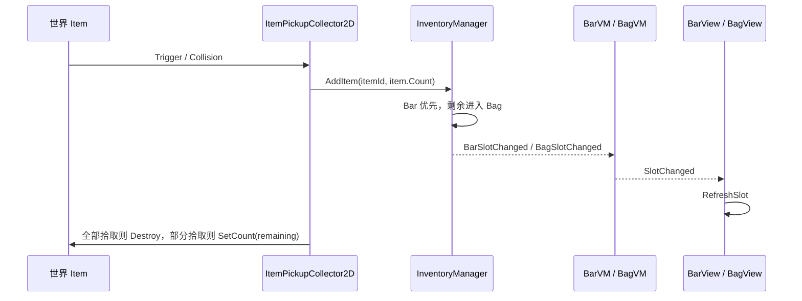
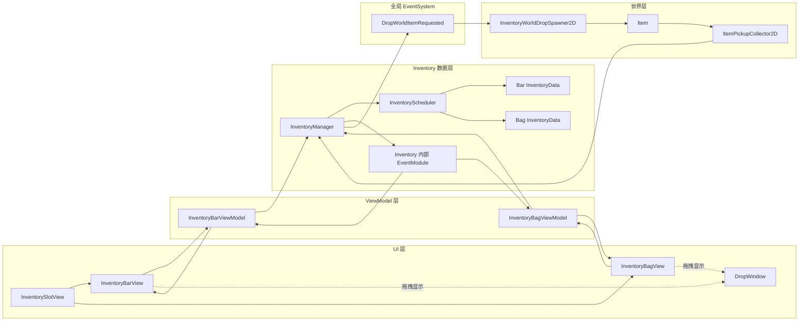
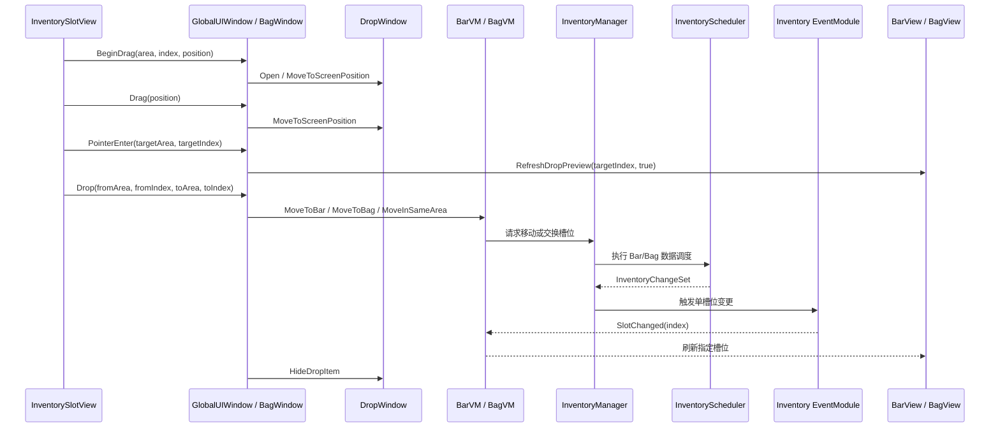
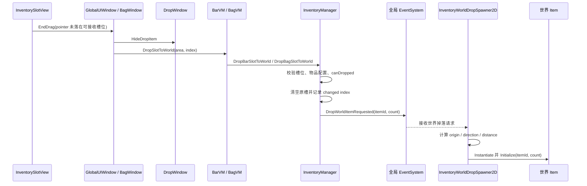
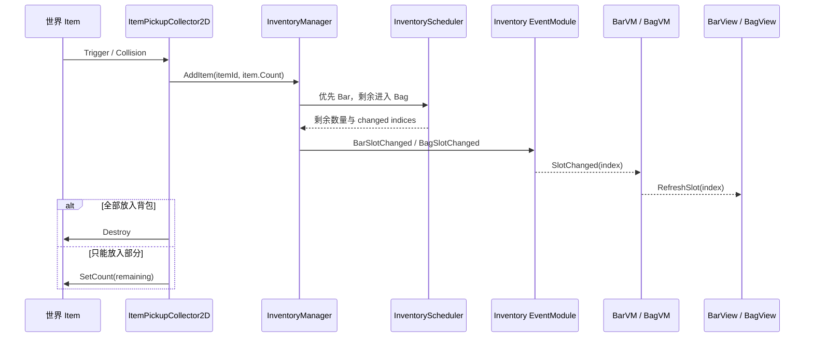

# Inventory 背包模块结构

## 目录职责

```text
Assets/Scripts/Inventory
├── Core
│   ├── InventoryManager.cs
│   ├── InventoryData.cs
│   ├── InventorySlotData.cs
│   ├── InventoryScheduler.cs
│   └── InventoryChangeSet.cs
├── Runtime
│   └── ItemPickupCollector2D.cs
├── UI
│   ├── InventoryBarView.cs
│   ├── InventoryBagView.cs
│   ├── InventoryBarViewModel.cs
│   ├── InventoryBagViewModel.cs
│   └── InventorySlotViewData.cs
└── Test
    └── InventoryOdinTester.cs
```

## Core



`Core` 存放背包的数据核心与调度核心，不直接处理具体 UI 表现。

- `InventoryManager`：背包对外入口，统一管理 Bar 和 Bag 数据。
- `InventoryData`：单个槽位集合的数据容器，负责堆叠、移除、拆分、合并、快照和容量整理。
- `InventorySlotData`：单个槽位数据，只保存 `itemId` 和 `count`。
- `InventoryScheduler`：协调 Bar 与 Bag 之间的移动、拆分、合并和拾取分配。
- `InventoryChangeSet`：记录本次操作影响到的 Bar/Bag 槽位索引，用于局部刷新。
- `InventoryEventType` / `InventoryEventArgs`：InventoryManager 内部事件模块使用的事件类型和事件参数。

## Runtime

`Runtime` 存放场景运行时行为脚本。

- `ItemPickupCollector2D`：碰撞到物品后，将物品提交给 `InventoryManager`。

## UI / MVVM

UI 层采用 MVVM 思路：

```text
View 输入
-> ViewModel 用户意图方法
-> InventoryManager 数据操作
-> InventoryChangeSet / Changed 事件
-> ViewModel 刷新 ViewData
-> View 刷新显示
```

- View 只处理前端控件、点击转发和视觉刷新。
- ViewModel 持有 UI 状态和显示数据，不直接持久化背包数据。
- Core 层只关心数据和业务规则，不依赖具体窗口或 prefab。

## 拖拽与滚动输入规则

- `InventorySlotView` 的拖拽只表示物品移动，不负责驱动 `ScrollRect` 滚动。
- 空槽拖拽不进入物品拖拽状态，也不触发 `DropWindow`。
- Bag 内容滚动由鼠标滚轮和透明 Vertical Scrollbar 负责。
- 透明滚动条应保持 `Image` 启用并保留 `raycastTarget`，只把颜色 alpha 设为 0，避免失去鼠标拖拽能力。
- 拖到边缘自然滚动由 `InventoryDragEdgeScrollController` 处理，并由 `InventoryBagView` 持有和调用，不放在单个 SlotView 中。
- 边缘滚动使用真实 UI RectTransform 区域判定：`EdgeScrollTopArea`、`EdgeScrollDeadZoneArea`、`EdgeScrollBottomArea`。
- 三个区域的 `Image` 用不同颜色显示，但 `raycastTarget` 必须关闭，避免影响槽位 hover、drop 和 click。

## 容量规则

- `BagCapacity` 表示 Bag 当前已解锁槽位数量。
- `Capacity` 表示 Bag 最大容量上限。
- `ExpandBagCapacity(additionalSlotCount)` 只增加当前已解锁容量，不会超过 `Capacity`。
- 扩容只在当前 `bagData` 实例上追加空槽位，不替换 `bagData`，因此不需要重建 `InventoryScheduler`。
- Bar 当前保持固定容量，由 `BarCapacity` 表示。

## 拾取规则

普通拾取物品时：

```text
AddItem
-> 先进入 Bar
-> Bar 同类堆叠满或 Bar 无空槽
-> 剩余进入 Bag
-> 返回最终未能放入的剩余数量
```

## 变更通知规则

- `InventoryManager` 自己持有模块内部 `EventCenterModule<int>`，不把槽位刷新事件发布到全局 EventSystem。
- 单个槽位变化时通过 `RegisterBarSlotChanged` 或 `RegisterBagSlotChanged` 订阅。
- 容量变化、加载数据、清空数据等结构性变化通过 `RegisterBarSlotsChanged` 或 `RegisterBagSlotsChanged` 订阅。
- 数据层操作应尽量通过 `InventoryChangeSet` 收集变化索引，避免 UI 每次全量刷新。
- ViewModel 到 View 的刷新事件仍保留本地 C# event，用于对象内部 UI 绑定。

## 辅助图

结构图见同目录下的 `inventory-architecture.html`。

## 系统交互图

### 总体数据流



### Bar 与 Bag 拖拽交换



### 拖出 UI 丢弃到世界



### 世界物品拾取回流



### 职责边界

- `InventorySlotView` 只处理槽位显示、点击和拖拽输入，不直接修改背包数据。
- `InventoryBarView` / `InventoryBagView` 负责 UI 容器、拖拽表现和槽位刷新。
- `InventoryBarViewModel` / `InventoryBagViewModel` 负责把 UI 意图转为数据层调用，并把数据变更转成 ViewData。
- `InventoryManager` 是背包数据入口，负责校验规则、触发内部刷新事件，以及向全局事件系统发出跨系统请求。
- `InventoryWorldDropSpawner2D` 只响应全局掉落事件，负责在世界中生成 `Item`。
