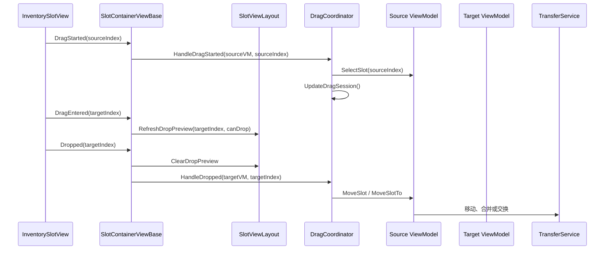
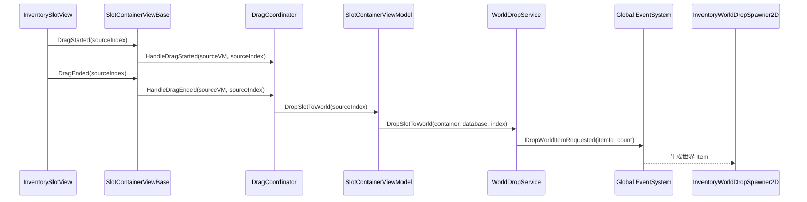

# Inventory 模块说明

## 模块目标

Inventory 模块负责玩家快捷栏、背包以及后续宝箱等槽位容器的数据管理、UI 显示和拖拽交互。

当前核心方向：
- Bar 和 Bag 数据分离。
- Bar 是固定槽位快捷栏。
- Bag 是可扩容、可虚拟滚动的槽位容器。
- ViewModel 负责 UI 意图、选择状态和显示数据。
- View/Layout 负责视觉刷新、槽位复用、DropPreview 和滚动表现。
- 跨系统的世界掉落通过全局 EventSystem 通知。

## Core 数据层

- `InventoryManager`：玩家 Inventory 数据入口，负责 Bar/Bag 容器生命周期、拾取分配、容量扩展等对外操作。
- `InventoryDataContainer`：普通槽位数据容器，承载 `InventoryData` 和容量。
- `ExpandableInventoryDataContainer`：可扩容槽位容器，用于 Bag。
- `InventoryData`：槽位集合数据，只保存和处理槽位内容。
- `InventorySlotData`：单个槽位数据，只保存 `itemId` 和 `count`。

## ViewModel 层

- `InventorySlotContainerViewModel` 是通用槽位容器 ViewModel 基类。
- `InventoryBarViewModel` 继承通用 ViewModel，只保留 Bar 特有意图。
- `InventoryBagViewModel` 继承通用 ViewModel，只保留 Bag 特有容量语义。

ViewModel 负责：
- 维护 `SelectedIndex`。
- 提供 `InventorySlotViewData`。
- 接收 View 的用户意图。
- 调用数据层完成移动、合并、交换、丢弃。
- 把数据变化转换成 View 可消费的刷新事件。

## View 与 Layout

- `InventorySlotContainerViewBase<TViewModel>`：通用槽位容器 View 基类，负责绑定 ViewModel、订阅刷新事件、处理槽位点击和拖拽输入转发。
- `InventorySlotView`：最小槽位显示单元，只负责图标、数量、选中态、DropPreview 和 Unity 指针事件上报。
- `InventoryFixedSlotViewLayout`：固定槽位布局，用于 Bar，只负责生成/销毁槽位和按顺序刷新；排列交给 Unity Layout 组件。
- `InventoryVirtualizedSlotViewLayout`：虚拟滚动布局，用于 Bag，通过可见索引范围和字典管理当前显示槽位。
- `DropPreview` 只属于 View/Layout/SlotView，不进入 ViewModel。

## 拖拽职责

- `InventorySlotViewEventModule` 是单个槽位容器 View 内部的局部输入事件模块。
- `InventorySlotDragCoordinator` 只负责单次拖拽会话、跨 ViewModel 数据移动和拖出 UI 丢弃。
- Coordinator 不长期注册、不缓存、不拥有 ViewModel；只在当前拖拽会话中临时保存来源 ViewModel，拖拽结束立即清空。
- Coordinator 不处理 `ScrollRect`、Layout、边缘滚动或 DropPreview。
- Bag 边缘滚动由 `InventoryBagView` 和 `InventoryDragEdgeScrollController` 处理。
- 拖拽跟随鼠标的视觉表现由 Coordinator 注册到 `PublicMono.Update` 后驱动 `DropWindow`。

## 拖拽事件时序

### 成功释放到槽位

### 拖出 UI 丢弃

## 世界掉落流程

- UI 拖出槽位后，不直接生成世界物体。
- ViewModel 调用 `InventorySlotWorldDropService`。
- Service 校验槽位、物品配置和 `canDropped`。
- Service 扣除整格数据。
- Service 通过全局 EventSystem 发送 `DropWorldItemRequested`。
- `InventoryWorldDropSpawner2D` 监听事件并生成一个世界 `Item`。
- 世界 `Item` 保存数量，但不显示数字。

## 滚动输入规则

- `InventorySlotView` 的拖拽只表示物品移动，不驱动 `ScrollRect`。
- 空槽拖拽不会进入物品拖拽状态，也不会打开 `DropWindow`。
- Bag 的普通滚动由鼠标滚轮和 Scrollbar 负责。
- Bag 的边缘自动滚动由 `InventoryDragEdgeScrollController` 处理。
- 边缘滚动判定使用真实 UI 区域，判定区域不启用 `raycastTarget`，避免影响槽位 hover、drop 和 click。

## 职责边界

- `InventorySlotView` 不直接修改背包数据，也不直接引用 ViewModel。
- `InventorySlotContainerViewBase` 持有并绑定 ViewModel，是 Slot 输入转 ViewModel/Coordinator 的桥接层。
- `InventoryVirtualizedSlotViewLayout` 不持有 ViewModel，只消费 ViewData。
- `InventorySlotDragCoordinator` 不关心 UI 布局和滚动。
- `InventoryManager` 不关心具体 UI 窗口和拖拽表现。
