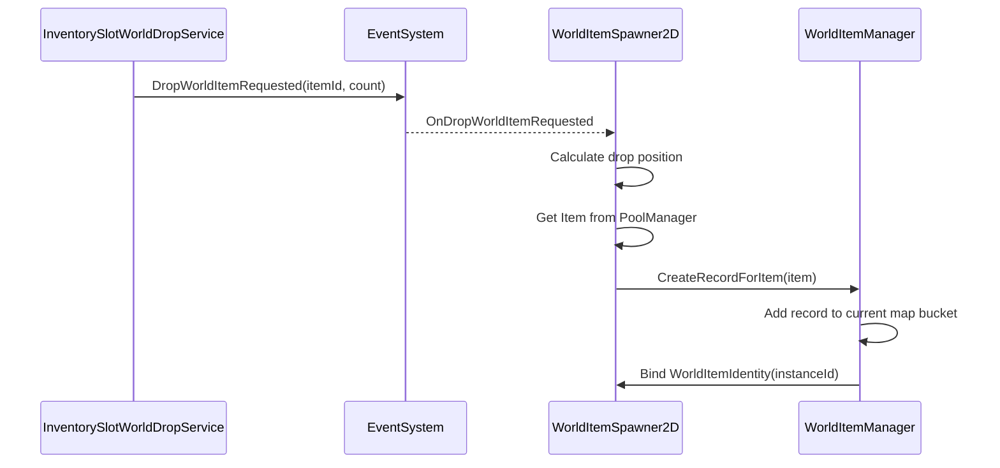

# WorldItem System

## 目标

WorldItem 系统负责管理掉落在世界中的可拾取物品，并把运行时数据与场景可见对象分开。

- `WorldItemManager` 只管理世界物品数据记录，不生成、不销毁、不回收 `GameObject`。
- `WorldItemSpawner2D` 负责从对象池生成世界 `Item`，并在场景切换或刷新时重建当前 map 的可见对象。
- `ItemPickupCollector2D` 负责拾取碰撞到的世界 `Item`，完整拾取后删除记录并自行回收对象。
- `WorldItemIdentity` 负责把场景中的 `Item` 关联回对应的数据记录。

当前 `mapId` 使用 `SceneSystem.CurrentScene.name`。数据按 mapId 分桶保存，`WorldItemRecord` 本身不保存 mapId。

## 数据结构

- `WorldItemRecord`：单个世界物品记录，保存 `InstanceId`、`ItemId`、`Count`、`Position`。
- `WorldItemSceneBucket`：单个 map 的记录桶，内部维护 `Dictionary<int, WorldItemRecord>`。
- `WorldItemManager`：静态数据管理器，内部维护 `Dictionary<string, WorldItemSceneBucket>`。
- `WorldItemIdentity`：挂在世界 `Item` 对象上，只保存 `InstanceId`。

`InstanceId` 使用 `int`，用于区分同一地图中多个相同 `itemId` 的世界物品。

## 对象池

`WorldItemSpawner2D` 使用 WSFrame 对象池生成世界物品：

- 默认加载 key：`Prefabs\ItemPrefab`
- 默认 label：`Prefab`
- 默认预热数量：`8`
- 默认最大容量：`64`

运行时调用：

```csharp
PoolManager.Instance.Prewarm(itemPrefabKey, prewarmCount, maxPoolCapacity);
PoolManager.Instance.Get(itemPrefabKey, itemParent);
PoolManager.Instance.Recycle(item.gameObject);
```

对象池运行时 API 只接收 key；label 作为资源约定保留在 `WorldItemSpawner2D` Inspector 字段中。

## 生成流程

背包丢弃物品时：



## 场景刷新

切换场景或 `WorldItemSpawner2D.OnEnable` 时调用 `RefreshVisibleWorldItems()`：

1. 扫描 `itemParent` 下所有带 `WorldItemIdentity` 且 `HasIdentity` 为 true 的 `Item`。
2. 清理这些 Item 的 `WorldItemIdentity`。
3. 使用 `PoolManager.Instance.Recycle(item.gameObject)` 回收旧可见对象。
4. 从 `WorldItemManager.GetCurrentMapRecords()` 读取当前 mapId 的记录。
5. 为每条记录从对象池取出一个 `Item`。
6. 调用 `item.Initialize(record.ItemId, record.Count)`。
7. 调用 `WorldItemManager.BindRecordToItem(item, record.InstanceId)`。

手动摆放但未绑定 `WorldItemIdentity` 的 `Item` 不会被场景刷新回收。

## 拾取流程

`ItemPickupCollector2D` 属于 WorldItem 交互入口，但会调用 `InventoryManager` 把物品加入玩家背包。

- 部分拾取：`item.SetCount(remaining)` 后调用 `WorldItemManager.UpdateRecordFromItem(item)`。
- 完整拾取：调用 `WorldItemManager.RemoveRecordForItem(item)` 删除记录，然后调用 `PoolManager.Instance.Recycle(item.gameObject)` 回收对象。

`ItemPickupCollector2D` 不引用 `WorldItemSpawner2D`。`WorldItemManager.RemoveRecordForItem` 只删除数据，不负责回收场景对象。

## 使用约定

- 世界物品 prefab 必须包含 `GameData.Item`。
- 生成世界物品必须走 `WorldItemSpawner2D`，不要手动 `Instantiate`。
- 修改世界物品数量后，应调用 `WorldItemManager.UpdateRecordFromItem`。
- 完整移除世界物品时，应先调用 `WorldItemManager.RemoveRecordForItem`，再由调用方回收或销毁对象。
- `WorldItemRecord` 不保存 mapId；mapId 只作为 `WorldItemManager` 外层桶 key。
